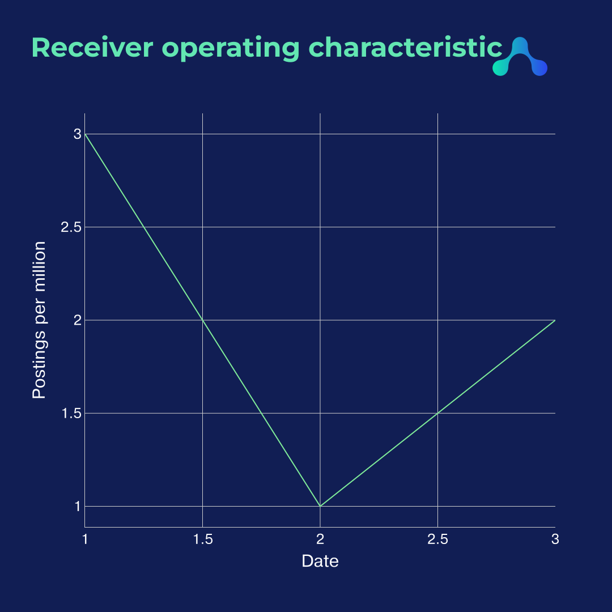
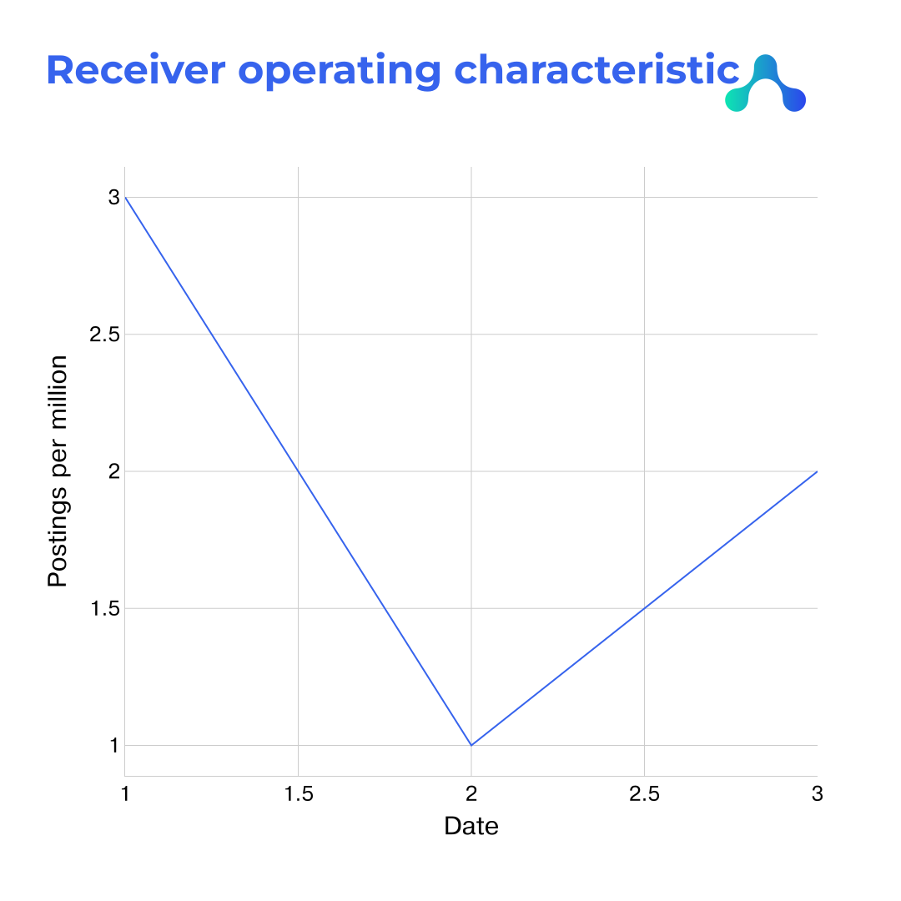

# Python library to produce Harmony branded graphs in Plotly

## Installation

```
python setup.py install
```

## Usage

### Dark theme

```
import harmonybrand

import plotly.express as px
fig = px.line(x=[1,2,3], y=[3,1,2],
                title="<b>Receiver operating characteristic</b>")

harmonybrand.harmonydark(fig)

fig.show(renderer="png")
```



or

### Light theme

```
import harmonybrand

import plotly.express as px
fig = px.line(x=[1,2,3], y=[3,1,2],
                title="<b>Receiver operating characteristic</b>")

harmonybrand.harmonylight(fig)

fig.show(renderer="png")
```



You need TTF files in same folder: `Montserrat-ExtraBold.ttf` and `Pragmatica-Regular.ttf`.
